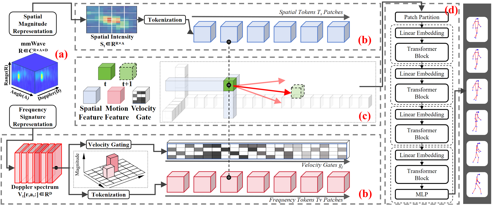

# PULSE: Doppler Prompting for Stable mmWave-based Human Pose Estimation

**ICML 2026** | [Paper](https://arxiv.org/abs/XXXX.XXXXX) <!-- replace with actual arXiv link -->

Shuntian Zheng, Jiaqi Li, Xiaoman Lu, Shuai He, Yu Guan

*Department of Computer Science, University of Warwick* &nbsp;·&nbsp; *Beijing University of Posts and Telecommunications*

Correspondence: Yu.Guan@warwick.ac.uk

---

## Overview

Millimeter-wave (mmWave) radar enables privacy-preserving, illumination-robust human pose estimation (HPE). Each mmWave frame is a range–angle–Doppler (RAD) tensor that encodes both *where* reflectors are (spatial magnitude) and *how* they move (Doppler signature). However, Doppler signatures are not human-exclusive — clutter, multipath reflections, and hardware artefacts produce spurious spectral responses that existing methods either ignore or naïvely fuse with spatial features, leading to jittery pose trajectories.

**PULSE** (Prompting Using Local Spectral Estimates) reconceptualises Doppler as a *screened motion prompt* rather than a symmetric feature channel. A confidence gate filters unreliable Doppler responses before they influence spatial reasoning, and locality-restricted cross-attention ensures that only spatially coherent motion cues condition the pose backbone.



Key results across three public datasets (HuPR, XRF55, mmRadPose), single- and multi-person settings:

- **Single-frame PULSE (1F)** outperforms all single-frame baselines on MPJPE, PA-MPJPE, MPJVE, and AKV, and achieves lower MPJVE than the multi-frame baseline mmDiff on HuPR.
- **Multi-frame PULSE (KF)** sets the best numbers across every dataset and metric.
- PULSE is **lightweight**: 12M parameters, 5.1 ms per frame, 75 MFLOPs — the smallest model in the comparison.
- PULSE works as a **plug-in**: replacing the front-end fusion of mmDiff or milliMamba with PULSE prompting consistently improves both MPJPE and MPJVE without touching the backbone.

---

## Method

PULSE comprises four stages:

1. **Dual-domain feature construction** — spatial magnitude $\mathbf{S}_t$ (Doppler-averaged) and Doppler signature $\mathbf{V}_t$ are derived from the RAD tensor $\mathbf{H}_t$.

2. **Tokenization** — $\mathbf{S}_t$ is split into $P_r \times P_a$ non-overlapping patches (spatial tokens); each range–angle cell in $\mathbf{V}_t$ is embedded independently (Doppler tokens). Both token sets share the same lattice.

3. **Confidence-gated local cross-attention** — a learnable gate $g_{t,j} \in [0,1]$ scores each Doppler token for motion relevance. Spatial tokens attend to Doppler tokens only within a local neighbourhood $\mathcal{N}(i)$ (default $3{\times}3$ patch window), weighted by the gate. This suppresses cross-region spectral leakage and nuisance-driven responses.

4. **Pose regression** — motion-conditioned spatial tokens are processed by stacked transformer layers and a lightweight MLP head to produce 3D joint coordinates.

A **multi-frame extension** (PULSE-KF) replaces single-frame Doppler tokens with confidence-weighted aggregates over a short window of $K$ frames, further improving prompt reliability without modifying the spatial backbone.

---

## Results

### Single-person evaluation

| Dataset | Method | MPJPE↓ | PA-MPJPE↓ | MPJVE↓ | AKV↓ |
|---------|--------|--------|-----------|--------|------|
| HuPR | HuPRModel (SF) | 65.37 | 58.11 | 14.70 | 14.1 |
| HuPR | MvDoppler (SF) | 69.71 | 65.56 | 13.11 | 13.4 |
| HuPR | mmDiff (MF) | 65.54 | 60.02 | 13.60 | 5.7 |
| HuPR | milliMamba (MF) | 64.08 | 57.44 | 11.69 | 7.8 |
| HuPR | **PULSE 1F (SF)** | **60.57** | **54.15** | **9.78** | **5.1** |
| HuPR | **PULSE KF (MF)** | **58.64** | **53.01** | **8.16** | **5.0** |
| XRF55 | **PULSE 1F (SF)** | **70.34** | **67.51** | **15.33** | **7.1** |
| XRF55 | **PULSE KF (MF)** | **68.99** | **63.81** | **14.05** | **6.5** |
| mmRadPose | **PULSE 1F (SF)** | **68.83** | **60.80** | **12.90** | **6.5** |
| mmRadPose | **PULSE KF (MF)** | **67.56** | **59.19** | **11.70** | **5.4** |

SF = single-frame input; MF = multi-frame input (K=9). All numbers in mm or mm/frame. No post-hoc smoothing applied to any method.

### Plug-in results

| Backbone | Dataset | MPJPE orig.↓ | MPJPE +PULSE↓ | MPJVE orig.↓ | MPJVE +PULSE↓ |
|----------|---------|-------------|--------------|-------------|--------------|
| mmDiff | HuPR | 65.54 | **60.89** | 13.60 | **10.07** |
| mmDiff | XRF55 | 79.06 | **72.56** | 21.44 | **16.02** |
| milliMamba | HuPR | 68.08 | **63.43** | 11.69 | **10.47** |
| milliMamba | XRF55 | 74.35 | **68.25** | 17.76 | **14.37** |

---

## Getting Started

### Requirements

```
Python >= 3.8
PyTorch >= 1.13
CUDA 12.1 (tested)
numpy, scipy, einops
```

Install dependencies:

```bash
pip install -r requirements.txt
```

### Dataset Preparation

We evaluate on three public datasets. Download links and licences are provided by the original authors.

| Dataset | Link | Notes |
|---------|------|-------|
| HuPR | [GitHub](https://github.com/robert80203/HuPR-A-Benchmark-for-Human-Pose-Estimation-Using-Millimeter-Wave-Radar) | RAD tensors, single-person |
| XRF55 | [Project page](https://aiotgroup.github.io/XRF55/) | RA + RD maps, multi-person |
| mmRadPose | [IEEE DataPort](https://ieee-dataport.org/documents/mmradpose) | RAD tensors, mocap GT, single-person |

After downloading, place or symlink each dataset under `data/`:

```
data/
├── HuPR/
├── XRF55/
└── mmRadPose/
```

Then run the preprocessing scripts:

```bash
python tools/preprocess_hupr.py       --root data/HuPR
python tools/preprocess_xrf55.py      --root data/XRF55
python tools/preprocess_mmradpose.py  --root data/mmRadPose
```

XRF55 provides RA and RD maps; `preprocess_xrf55.py` reconstructs the unified RAD tensor following the weighted-distribution procedure described in the paper (Appendix C).

### Training

Single-frame mode on HuPR:

```bash
python train.py --config configs/pulse_1f_hupr.yaml
```

Multi-frame mode (K=9):

```bash
python train.py --config configs/pulse_kf_hupr.yaml
```

Configuration files for all three datasets are provided under `configs/`.

### Evaluation

```bash
python eval.py --config configs/pulse_1f_hupr.yaml --ckpt checkpoints/pulse_1f_hupr.pth
```

This reports MPJPE, PA-MPJPE, MPJVE, and AKV without any post-hoc smoothing.

Cross-dataset generalisation (train on HuPR, test on mmRadPose):

```bash
python eval.py --config configs/pulse_1f_mmradpose.yaml \
               --ckpt  checkpoints/pulse_1f_hupr.pth \
               --cross_dataset
```

### Plug-in Usage

To replace the front-end fusion of an existing backbone with PULSE prompting:

```python
from pulse import PULSEPrompting

# Instantiate the PULSE prompting module
pulse_front_end = PULSEPrompting(
    range_bins=64, angle_bins=64, doppler_bins=16,
    patch_size=(4, 4), embed_dim=32,
    neighborhood=3, beta=1.0
)

# Forward: returns prompted spatial tokens ready for your backbone
spatial_tokens = pulse_front_end(H_t)          # single frame
spatial_tokens = pulse_front_end(H_window)     # multi-frame window
```

See `examples/plugin_mmdiff.py` and `examples/plugin_millimamba.py` for complete integration examples.

---

## Pre-trained Checkpoints

| Model | Dataset | MPJPE | MPJVE | Download |
|-------|---------|-------|-------|----------|
| PULSE 1F | HuPR | 60.57 | 9.78 | [link](#) |
| PULSE KF | HuPR | 58.64 | 8.16 | [link](#) |
| PULSE 1F | XRF55 | 70.34 | 15.33 | [link](#) |
| PULSE KF | XRF55 | 68.99 | 14.05 | [link](#) |
| PULSE 1F | mmRadPose | 68.83 | 12.90 | [link](#) |
| PULSE KF | mmRadPose | 67.56 | 11.70 | [link](#) |

<!-- Replace [link](#) with actual release asset URLs once uploaded -->

---

## Repository Structure

```
PULSE/
├── configs/                  # YAML configs for all datasets and modes
├── data/                     # Symlink or place datasets here
├── tools/                    # Preprocessing scripts
├── pulse/
│   ├── model.py              # Full PULSE model
│   ├── prompting.py          # Confidence-gated cross-attention module
│   ├── tokenizer.py          # Spatial and Doppler tokenization
│   └── multiframe.py         # Multi-frame Doppler aggregation
├── examples/
│   ├── plugin_mmdiff.py
│   └── plugin_millimamba.py
├── train.py
├── eval.py
├── requirements.txt
└── README.md
```

---

## Hyperparameters

| Parameter | Value |
|-----------|-------|
| Range × Angle resolution | 64 × 64 (after resampling) |
| Doppler bins $D$ | 16 |
| Spatial patch size $P_r \times P_a$ | 4 × 4 |
| Spatial tokens $N_s$ | 256 |
| Doppler tokens $N_v$ | 4096 (cell-level) |
| Embedding dim $d$ | 32 |
| Transformer depth | 4 layers |
| Attention heads | 4 |
| Cross-attention neighbourhood | 3 × 3 patch window |
| Gate strength $\beta$ | 1.0 |
| Multi-frame window $K$ | 9 |
| Optimizer | Adam |
| Learning rate | 1e-4 |
| Weight decay | 0.01 |
| Batch size | 8 |
| Epochs | 100 |

---

## Citation

If you find this work useful, please cite:

```bibtex
@inproceedings{zheng2026pulse,
  title     = {Doppler Prompting for Stable mmWave-based Human Pose Estimation},
  author    = {Zheng, Shuntian and Li, Jiaqi and Lu, Xiaoman and He, Shuai and Guan, Yu},
  booktitle = {Proceedings of the 43rd International Conference on Machine Learning (ICML)},
  year      = {2026}
}
```

---

## Acknowledgements

This research is funded by the Department of Computer Science, University of Warwick.

---

## Licence

This project is released under the MIT Licence. See [LICENSE](LICENSE) for details.

The datasets (HuPR, XRF55, mmRadPose) are subject to their own licences; please refer to the respective dataset pages before use.
